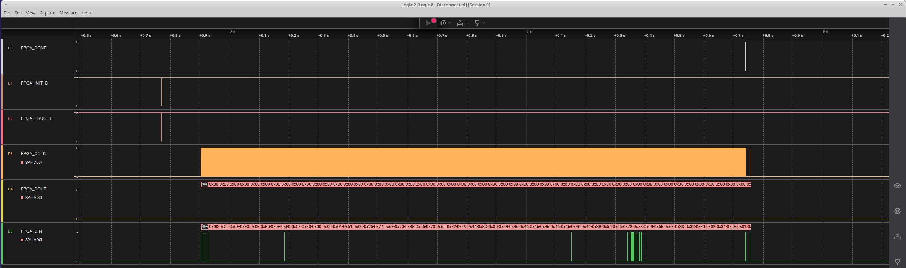
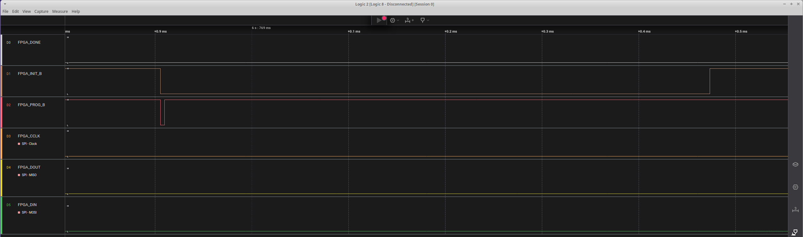
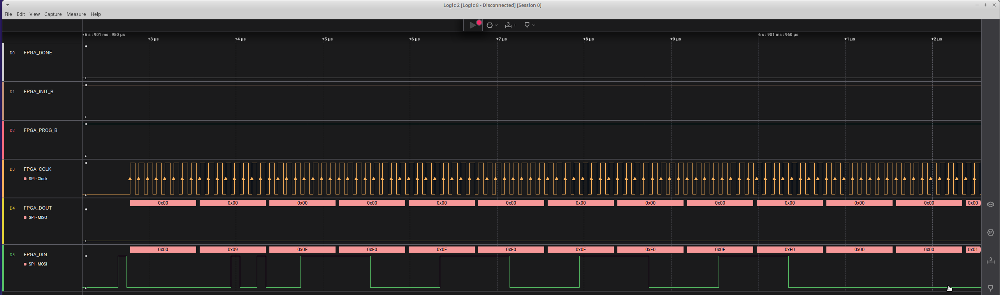
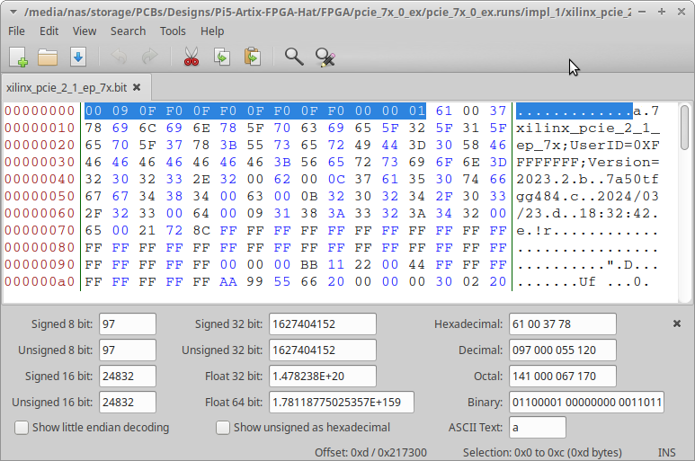
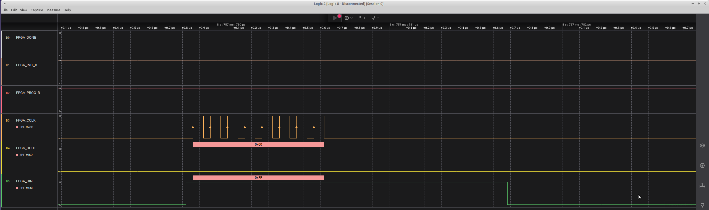

# FPGA Programming Script

The image below shows the entireity of the FPGA programming.

# Init

* PROGRAM_B dropped low until INIT_B falls low, around 4us.
* Wait for INIT_B to rise, indicating FPGA is ready, around 570us.

# Sending the filefile

* Send the bitfile using SPI0 on the Pi5. The exact device doesn't matter as we aren't using the hardware chip select lines.
* The Xilinx diagrams show LSB-first. The text says to use MSB-first. The FPGA works with either. My code uses MSB-first as it's the SPI standard.
* The FPGA will happily program with a 100 MHz clock. I didn't try any faster. Debugging was done at 10 MHz.
* The Xilinx Diagrams show SPI Mode 0: that is, clock idle low, FPGA reading data on rising edge.

Below shows a higlighed hexeditor view of the above SPI bytes.

# Programming DONE

The programming DONE signal usually asserts before the end of the bit file. This is mentioned in the documentation.

# Special Start-Up Conditions

The Special Start-Up Conditions provisions for cases where the interal FPGA core needs a few external clock cycles to finish the configuration and setup process. This is referred to as compensating for 'Special Startup Conditions' and requires the Pi to send a further 8 clock cycles with DIN held high. This is accomplished by sending an 0xFF byte.

