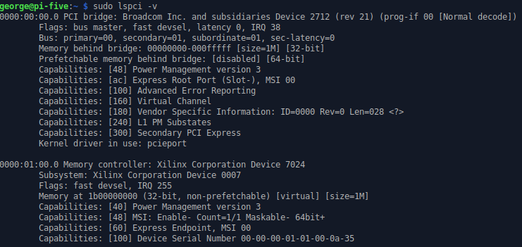

# PCIe Gen2 x1 FPGA Image

This folder contains the Vivado project for a PCIe Gen2 x1 test system. It's simply the PCIe 7-Series Reference Design by Xilinx, with some small tweaks to make it work on the Pi5.

This design is recognised by Linux on the Ras Pi 5:

# Rescanning the PCIe Bus

Once you have programmed the FPGA, the Pi will not immediately see it, since the Pi is a bit weird with hotplug detection, etc., so you'll need to run the following to kick the PCIe controller. Not really sure what this does, but, it works...

echo 1000110000.pcie > /sys/bus/platform/drivers/brcm-pcie/bind

# Legals

The files in the project mostly belong to AMD/Xilinx through their reference design. I am not asserting any claims over these files. They are provided for convenience.