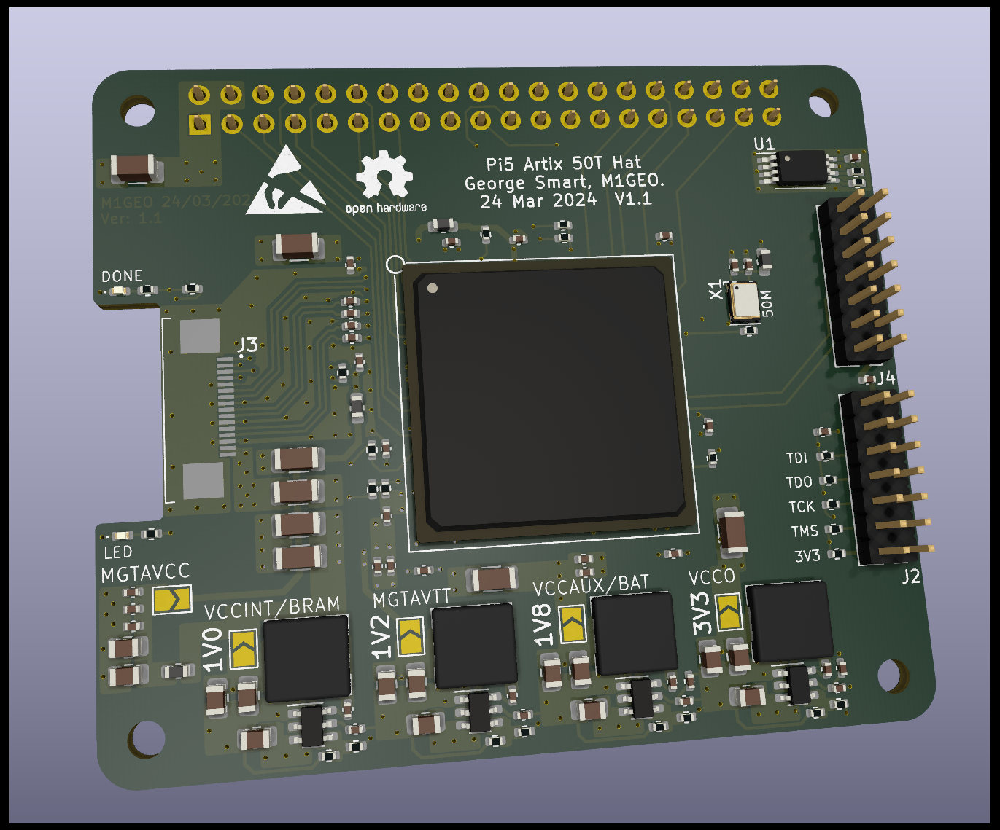

# Pi5-Artix-FPGA-Hat

An AMD/Xilinx Artix 50T FPGA on a Pi5 Hat with PCIe and GPIO interconnects as well as SPI programming using XC7A50T-2FGG484C.

The project uses a 4-layer PCB (which means some of the routing is a bit sub-optimal)!

The project includes pick-and-place and LCSC BoM files for JLCPCB PCBA services.

*Both SPI programming and PCIe have been tested and are functional.*

# Files

The PCB design files are inside the PCB folder, along with the schematic in the PCB/outputs/ folder.

The FPGA folder has a simple Blinky (flashing LED) and PCIe design based on the Xilinx Reference Design with some small mods.

The FPGA/Programmer/ folder has a script for programming the FPGA via spidev and lgpio using Xilinx Serial Slave (essentially SPI).

# Licence

MIT Licence. See the LICENCE file included for details.

Files inside FPGA/pcie_7x_0_ex/ are Copyright AMD/Xilinx. Seek their licence and terms of use if required.

# Support

This project comes without any support. Although I would like to help, I simply do not have the time to do so.

You can drop me a donation via PayPal if you have found the project useful: [PayPal Donation to M1GEO](https://www.paypal.com/paypalme/m1geo)

# Images

