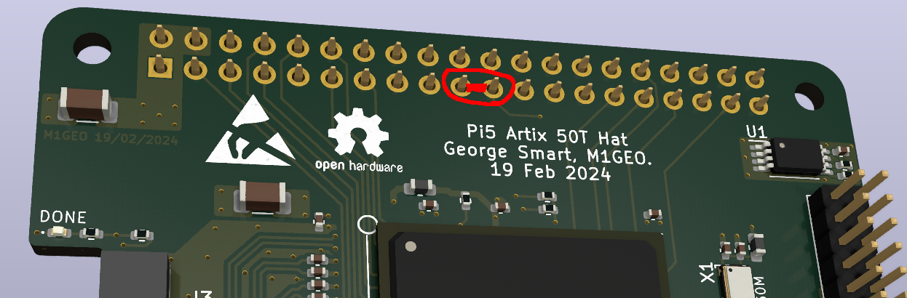

# Pi5-Artix-FPGA-Hat

An AMD/Xilinx Artix 50T FPGA on a Pi5 Hat with PCIe and GPIO interconnects as well as SPI programming using XC7A50T-2FGG484C.

The project uses a 4-layer PCB (which means some of the routing is a bit sub-optimal)!

The project includes pick-and-place and LCSC BoM files for JLCPCB PCBA services.

# !!IMPORTANT!!

The current PCB design files include a small bug where MISO and MOSI are crossed over. It's easy to short these two pins together (the FPGA's MISO is Hi-Z) and this gets things working. The design will be updated soon.

# Images

