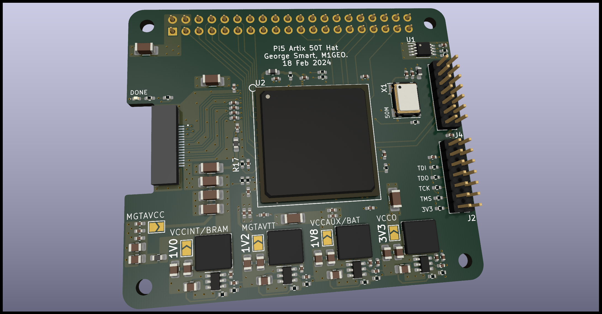
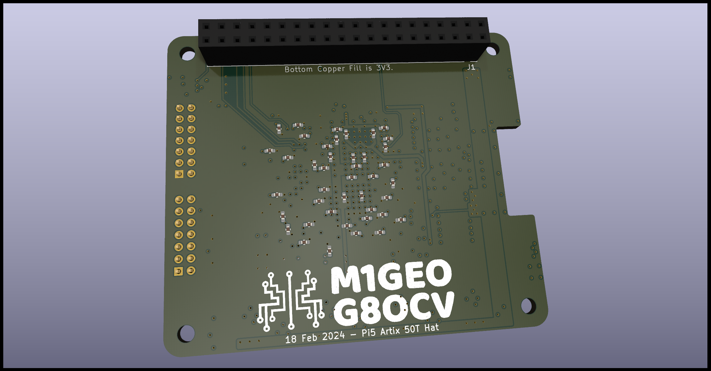

# Pi5-Artix-FPGA-Hat
An AMD/Xilinx Artix 50T FPGA on a Pi5 Hat with PCIe and GPIO interconnects as well as SPI programming using XC7A50T-2FGG484C.

The project uses a 4-layer PCB (which means some of the routing is a bit sub-optimal)!

The project includes pick-and-place and LCSC BoM files for JLCPCB PCBA services.

# Images

